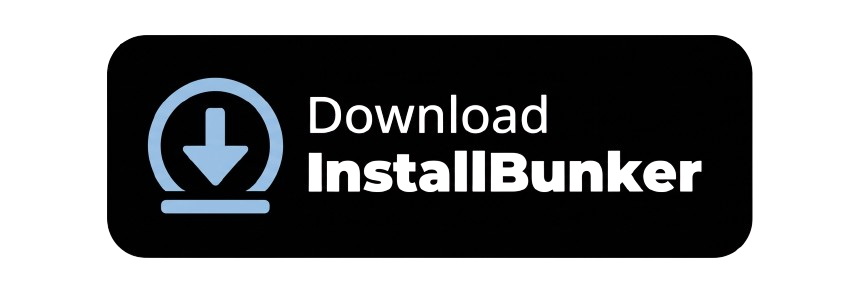
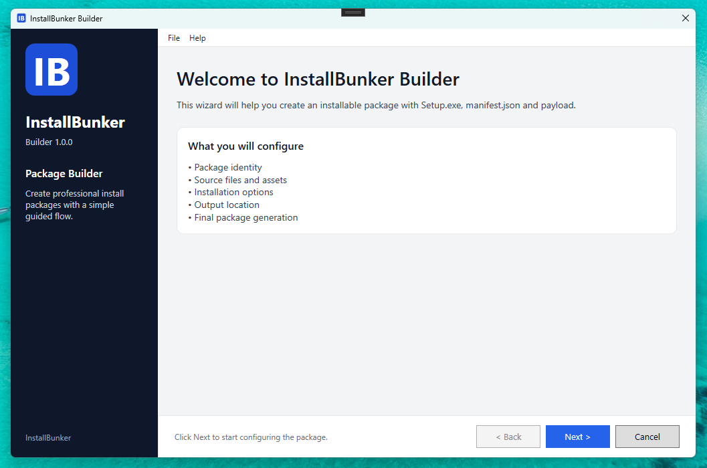
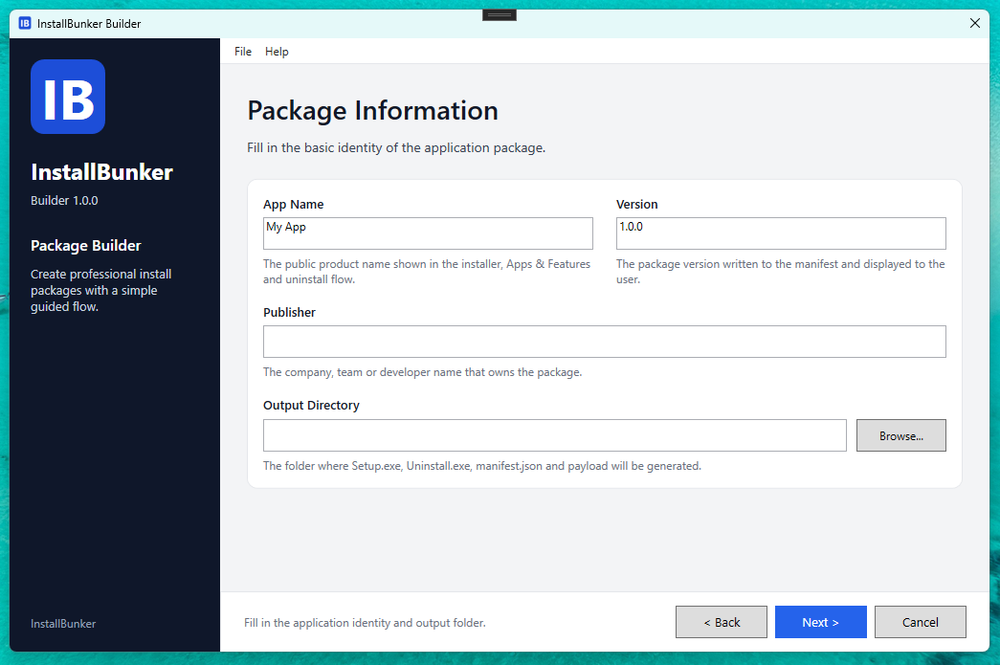
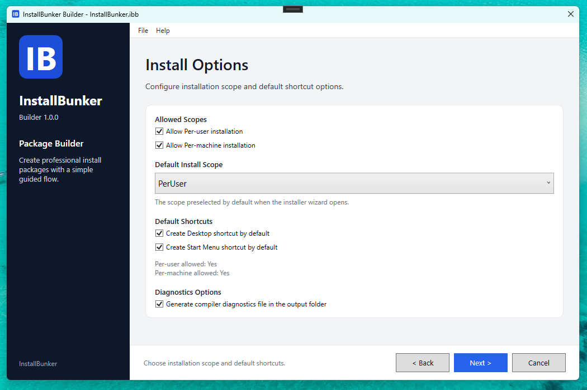

<!-- Replace the image below with your actual logo path -->


# InstallBunker For Windows (1.0.0)

Build professional installers for your Windows apps — no external tools required. :)

<!-- Replace the button image and link below with your actual download page -->
[]()

---

# InstallBunker

**InstallBunker** is a Windows (10/11) application that lets you package and distribute your desktop apps as polished, professional installers — without depending on any external tools or runtimes installed on your machine.

Through a clean, step-by-step wizard interface, you configure your package metadata, define installation behavior, and click **Build**. InstallBunker takes care of the rest: it compiles a fully branded Setup executable and an Uninstaller, ready to ship to your end users.

See the benefits of using **InstallBunker**:

- **Self-contained toolchain:** InstallBunker ships with an embedded `dotnet.exe` inside the `Modules/` folder. This means the compiler works out of the box — no .NET SDK installation required on the build machine.
- **Wizard-driven UI:** A guided, multi-step interface walks you through every configuration option, from app metadata to install scopes and shortcuts.
- **Per-User & Per-Machine installs:** Let users choose between installing for themselves or system-wide, with configurable default install directories for each scope.
- **Desktop & Start Menu shortcuts:** Optionally create shortcuts during installation with a single checkbox — no scripting needed.
- **License page support:** Show a license agreement to the user before installation proceeds, using any plain-text file of your choice.
- **Custom branding:** Set the installer window title, sidebar app name, version label, and welcome summary to match your product.
- **Auto-generated Uninstaller:** Every build produces a matching uninstaller registered with Windows, so your app appears correctly in *Add or Remove Programs*.
- **Project files:** Save and reopen your installer configurations as `.ibproj` files to iterate quickly across builds.
- **Diagnostics file:** Optionally generate a diagnostics log alongside your output for build troubleshooting.
- **Editable WPF templates:** The Setup and Uninstall UI templates are real, editable WPF files inside `BuilderResources/CompilerTemplates/`, allowing developers to inspect and customize the installer appearance.

---

## Application Images

<!-- Add your screenshot images here -->






---

## How to Run This Application Locally

This application was built using the following technologies:

- C#
- Windows Presentation Foundation (WPF)
- .NET 8 (net8.0-windows)

In conjunction with the following libraries:

- [Vestris.ResourceLib](https://github.com/resourcelib/resourcelib) — for patching executable icons at compile time.

To run this application on your local machine, make sure you have the latest version of **Visual Studio Community 2022** with the **.NET Desktop Development** workload installed.

### Steps

**1. Clone the repository**

```bash
git clone https://github.com/your-username/InstallBunker.git
```

**2. Open the solution**

Open the `InstallBunker.sln` file in Visual Studio 2022.

**3. Restore NuGet packages**

Visual Studio will automatically restore the required packages on first build. If needed, run:

```bash
dotnet restore
```

**4. Place the embedded toolchain**

InstallBunker requires a .NET SDK to be available inside the `Modules/` folder at runtime. This is the embedded `dotnet.exe` that powers the compiler without requiring any system-wide SDK installation.

> **Important:** The `Modules/` folder is not included in source control (it is excluded via `.gitignore`). You must populate it manually from a .NET 8 SDK distribution before running or publishing the Builder.

The expected structure inside `Modules/` mirrors a standard .NET SDK layout, for example:

```
Modules/
  dotnet.exe
  sdk/
  shared/
  packs/
```

**5. Build and run**

Set `InstallBunker.Builder.UI` as the startup project and press **F5** to run.

---

## Project Structure

The solution is organized into the following projects:

| Project | Description |
|---|---|
| `InstallBunker.Builder.UI` | The main WPF application — the visual wizard the user interacts with. |
| `InstallBunker.Compiler.Core` | The compiler engine responsible for materializing templates, invoking `dotnet publish`, and producing the final output. |
| `InstallBunker.Packager` | Handles packing all application files into a single `.ibpkg` container format. |
| `InstallBunker.Installer.Core` | Runtime logic used by the generated Setup executable to install files, registry entries, and shortcuts. |
| `InstallBunker.Uninstaller.Core` | Runtime logic used by the generated Uninstaller executable to cleanly remove the application. |
| `InstallBunker.Domain` | Shared domain models, enums, and manifest definitions used across all projects. |
| `InstallBunker.Common` | Common utilities including JSON serialization, path helpers, and the `.ibpkg` container format implementation. |

---

## Self-Contained by Design

One of InstallBunker's key design goals is that **it does not rely on anything pre-installed on the build machine**.

The `Modules/` folder ships alongside the published `InstallBunker.exe` and contains a full embedded .NET toolchain (`dotnet.exe` + SDK + shared frameworks). When you click **Build**, the compiler automatically detects and uses this embedded toolchain to compile and publish the Setup and Uninstaller bootstrappers — no system-wide .NET SDK is required.

This makes InstallBunker a true portable, self-sustaining build tool.

---

## Contribute

Want to add new features or improvements to **InstallBunker**? Make sure you create a new branch, implement your changes, and submit a **Pull Request** (PR).

Feel free to open PRs for:

- New features or UI improvements
- Bug fixes
- New translations or localization support
- Improvements to the WPF installer/uninstaller templates inside `BuilderResources/CompilerTemplates/`

All contributions are welcome and appreciated!

---

## License

This project is open-source and available under the [MIT License](LICENSE).